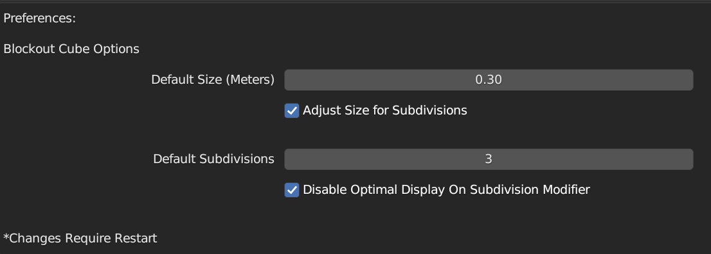

<h1 align="center">Blender Sculpting Blockout Cube</h1>

A simple Blender addon that adds a premade Sculpting Blockout Cube to the meshes context menu

 
 

<h3 align="center">Options</h3>

  
Default Size (can toggled between cube & subdivided mesh size)
   
  
Subdivisions Count

  
Optimal Display on Subdivision modifier

 
 

<h3 align="center">Context Panel</h3>

  
Added to the mesh context menu for easy creation
   
  

 
 

<h3 align="center">Properties Panel</h3>

  
Easily modifiable from the properties panel that pops up when a Blockout Cube is created
   
  

 
 

<h3 align="center">Preferences</h3>

  
Defaults can be set for the Blockout Cubes in the addon Preferences saving those precious seconds 😉
   
  

